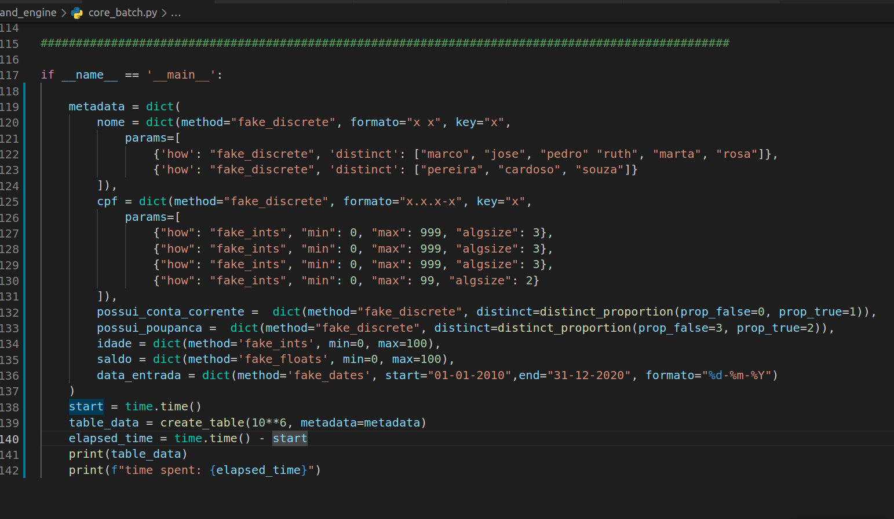
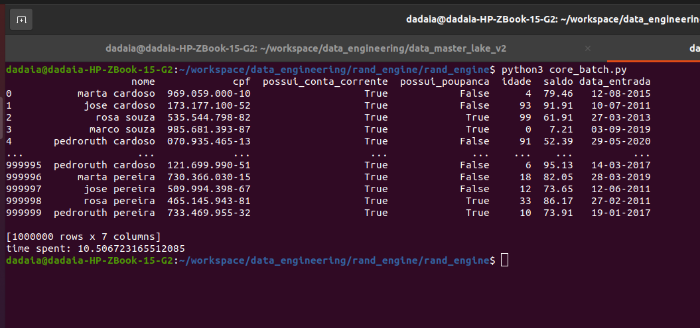
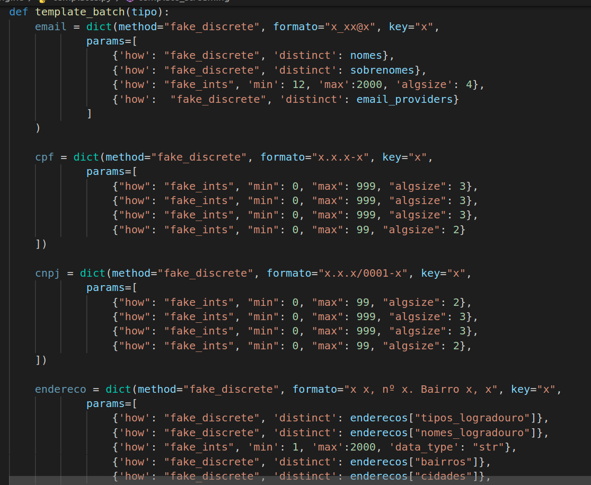
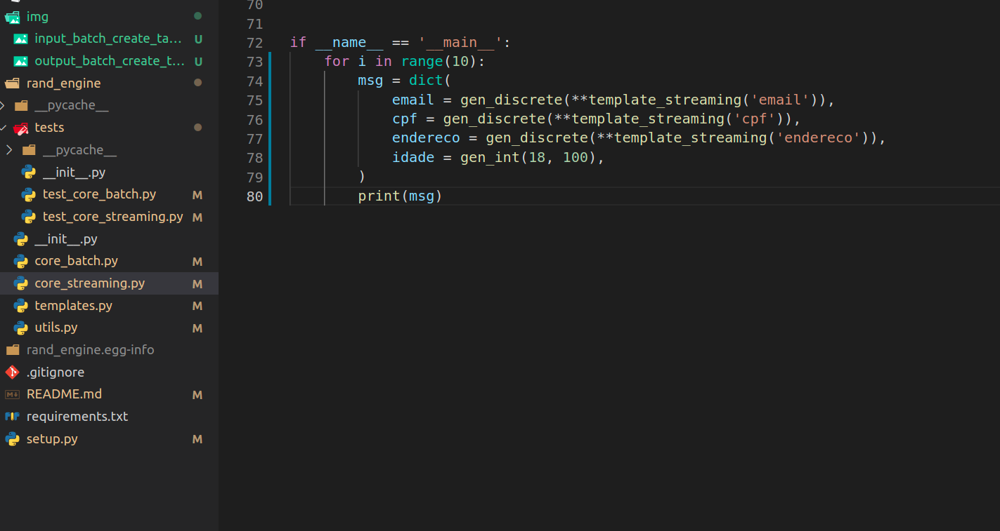
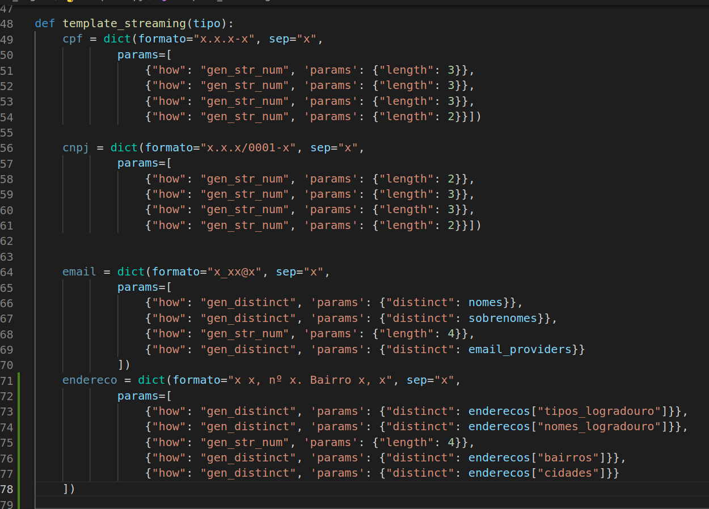
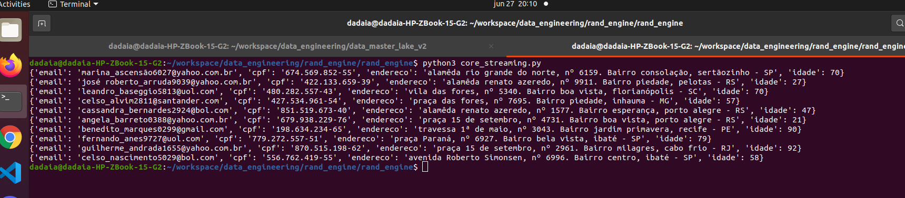

# Pacote Rand-Engine

Esse projeto visa a construção e uma ferramenta para geração de dados aleatórios, a partir de um schema e parâmetros de entrada. Sua aplicabilidade é voltada para geração de dados para estudo e testes de performance para ferramentas de Engenharia de Dados e Bigdata, auxiliando desenvolvedores em testes de funcionalidades ou regra de transformações de ETL com dados mocados.
 
Em sua construção foram adotadas as melhores práticas, de modo a reduzir complexidades e aumentar a velocidade na geração dos dados aleatórios.

Este é constituido por 2 módulos core:

<h2 style="color:darkred">módulo core_batch.py</h2>

Responsável pela geração de dados em batch, a partir de parametros passados para a função create_table. Essa função recebe como parâmetros um numero de linhas *size* um dicionário de metadados,*metadata* detalhado mais abaixo.

Abaixo é mostrado um exemplo de como é construído o parâmetro metadata, recebido pelo método *create_table*

A saída, para esse schema passado e um tamanho de 1 milhão de linhas é mostrada abaixo

<h2 style="color:darkred">templates batch</h2>
Para melhor entender a formação de colunas mais complexas, visite o script **templates.py**. Nele é possível ver a formação de 4 campos mais complexos, a partir de uma composição de dicionários e listas. Os campos template implementados são o de *endereço, cpf, cnpj e email*.

<h2 style="color:darkred">módulo core_streaming</h2>

 Responsável pela geração de valores para campos de uma mensagem de forma aleatória. Difere do módulo core_batch porque aqui o objetivo é passar metadados para se gerar uma linha de dados, e não multiplas. Os métodos aplicados nesse módulo não são tão rápidos como no primeiro, pois este primeiro consegue gerar dados aleatórios para 1 milhão de linhas de uma só vez, utilizando operações vetorizadas. Ja o módulo core_streaming tem por premissa gerar os dados linha por linha, ideal para suas aplicações.

Exemplo de entrada na construção de uma mensagem com campos de email, cpf, endereço e idade.

O método template_streaming utilizado como entrada deiva do módulo templates de nada mais é que configurações hipotéticas dos parâmetros de entrada para chegar a saídas específicas. Esses templates podem ser utilizados como base para construir campos mais complexos.

Saída para geração de dados acima, na forma de 20 mensagens.

