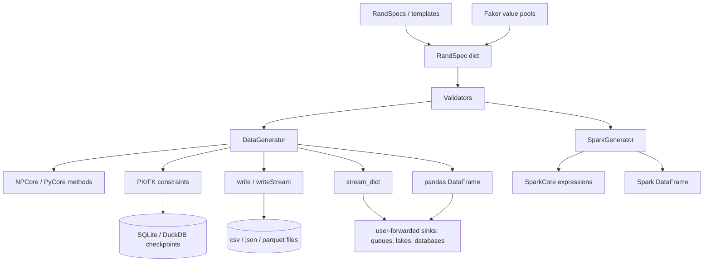

## Atomic view

rand-engine generates synthetic data very fast, for any platform and any sink, from a declarative
RandSpec: the NumPy core ([[data-generator]]) yields pandas DataFrames, record streams and files
([[writers-and-streaming]]) the user forwards to any queue, lake, database or file; Spark is
supported through the same spec ([[spark-generator]]). Correlated columns and pattern strings
([[generation-methods]]), checkpoint-backed PK/FK relations ([[pk-fk-constraints]]) and
ready-made specs ([[templates-and-examples]]) sit on a vectorized NumPy core.

## Users

| User | Description |
|------|-------------|
| Data engineers | Learn, stress-test pipeline throughput and bandwidth, and feed pipeline tests with synthetic data — batch or streaming, to any sink. |
| QA engineers | Build reproducible, relation-aware fixtures without hand-written data. |
| Developers and learners | Mock data for apps and demos from prebuilt specs, guided by validation messages that show a correct example. |

## Feature catalog

### api

| slug | title | tldr |
|------|-------|------|
| `public-api` | Public API | rand_engine exports DataGenerator, SparkGenerator and RandSpecs; every other module is internal. |

### content

| slug | title | tldr |
|------|-------|------|
| `templates-and-examples` | Templates and examples | Ready RandSpecs — ten cross-engine CommonRandSpecs, ten pandas-only AdvancedRandSpecs, and a UTC WebServerLogs template. |

### generation

| slug | title | tldr |
|------|-------|------|
| `data-generator` | DataGenerator | The pandas generator validates a RandSpec, owns its random generator, and returns DataFrames, files, file streams or an endless record stream. |
| `generation-methods` | Generation methods | Ten common methods run on pandas and Spark; four correlated methods plus pk and fk run on pandas. |
| `spark-generator` | SparkGenerator | The Spark generator builds a Spark DataFrame from common RandSpec methods with native expressions and no Python UDF. |

### output

| slug | title | tldr |
|------|-------|------|
| `writers-and-streaming` | Writers and streaming | DataGenerator writes CSV, JSON lines and Parquet batches or repeated file-stream microbatches through a Spark-style builder. |

### quality

| slug | title | tldr |
|------|-------|------|
| `benchmarks` | Performance benchmarks | A CI-only same-runner A/B benchmark measures every generation method and built-in sink, publishes its table and enforces a relative regression limit. |

### relations

| slug | title | tldr |
|------|-------|------|
| `pk-fk-constraints` | PK/FK key columns | Stateless pk and fk column methods create related tables from definitions, seeds and row indexes without a checkpoint store. |

### spec

| slug | title | tldr |
|------|-------|------|
| `rand-spec-grammar` | RandSpec grammar | A RandSpec maps output columns to a method, named kwargs and optional multi-column or transformer metadata, and is validated before generation. |

## Capability map

## Known limits

- Correlated methods, transformers and constraints run on pandas only; Spark runs the ten common methods.
- Seeds reach the pandas path only; Spark output is unseeded.
- PK/FK relations link generators through time-stamped checkpoint rows in one process.
- Built-in sinks are files only; queues, object storage and databases are reached by forwarding DataFrames or `stream_dict` records.
- pandas generation holds the whole batch in memory in one process.
